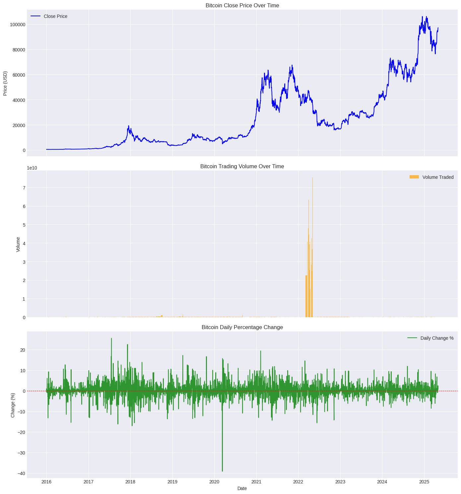
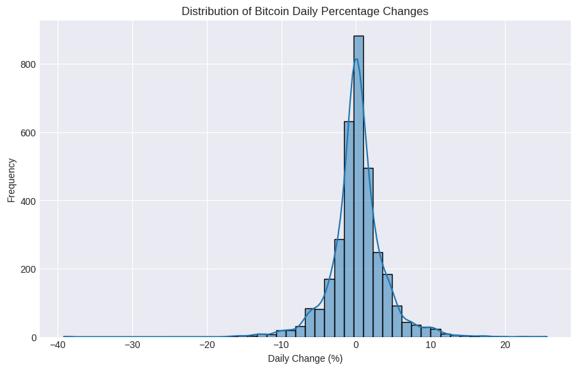
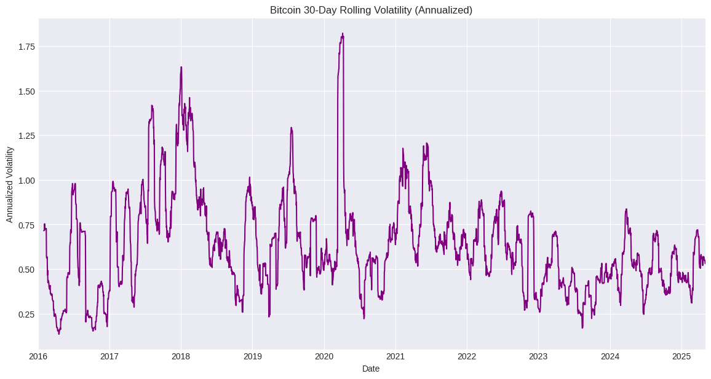
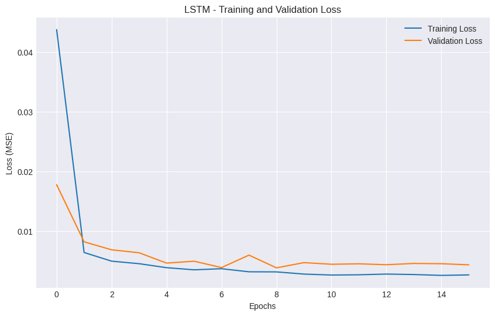
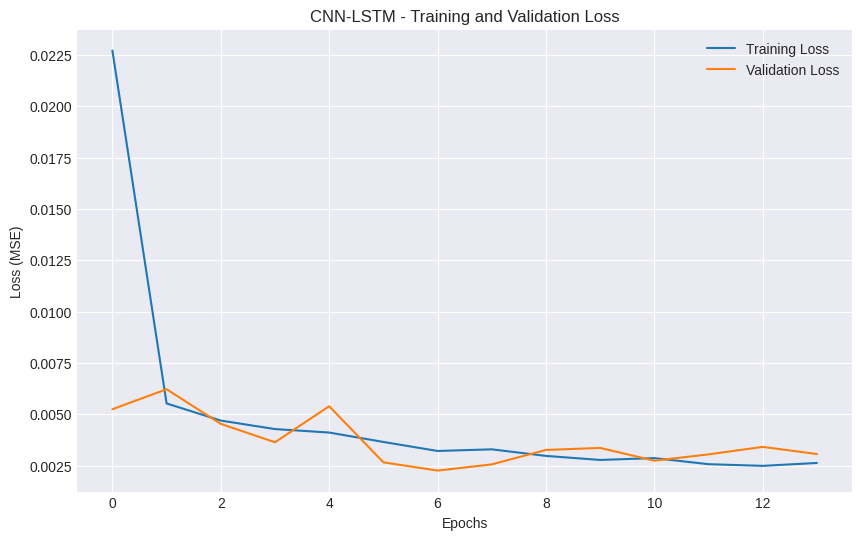
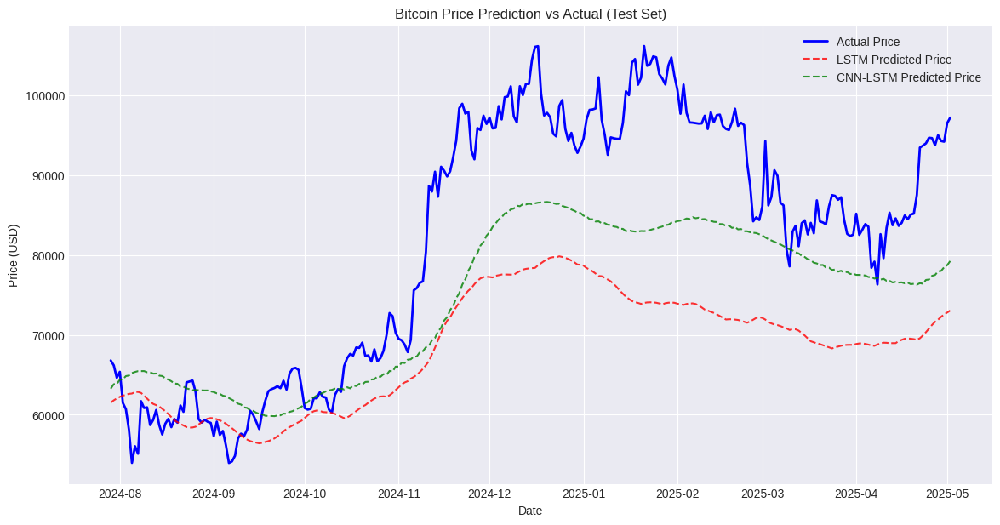
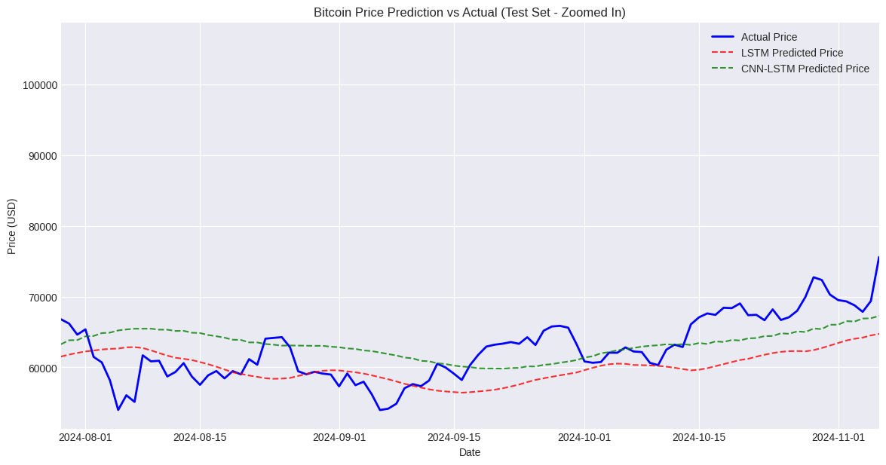
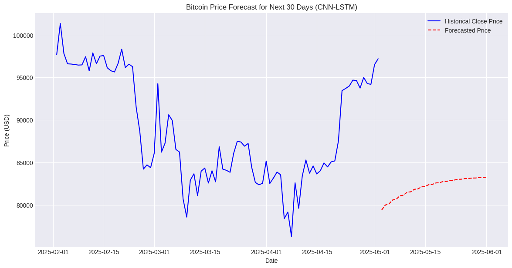

# Prediksi Harga Bitcoin Menggunakan Metode Deep Learning (LSTM & CNN-LSTM)

- **Nama:** Harry Mardika
- **Tanggal:** 3 Mei 2025

## Domain Proyek

Bitcoin (BTC) merupakan aset kripto paling populer dan memiliki kapitalisasi pasar terbesar. Harganya dikenal sangat fluktuatif dan dipengaruhi oleh berbagai faktor kompleks, termasuk sentimen pasar, berita regulasi, tren makroekonomi, adopsi teknologi, dan dinamika penawaran-permintaan internal blockchain. Tingginya volatilitas ini menawarkan peluang keuntungan yang signifikan bagi investor dan *trader*, namun juga membawa risiko kerugian yang besar.

Oleh karena itu, kemampuan untuk memprediksi pergerakan harga Bitcoin menjadi sangat penting. Prediksi yang akurat dapat membantu para pemangku kepentingan (investor, *trader*, institusi keuangan, analis pasar) dalam membuat keputusan investasi yang lebih terinformasi, mengelola risiko portofolio, mengoptimalkan strategi perdagangan (*trading*), dan memahami dinamika pasar kripto secara lebih baik. Namun, sifat harga Bitcoin yang non-linier, non-stasioner, dan dipengaruhi banyak faktor tak terduga membuat prediksi menjadi tugas yang sangat menantang.

Pendekatan *machine learning*, khususnya model *deep learning* untuk data deret waktu (*time series*), telah menunjukkan potensi dalam menangkap pola kompleks dan dependensi jangka panjang pada data harga aset finansial. Model seperti *Long Short-Term Memory* (LSTM) dan *Convolutional Neural Network* (CNN) yang digabungkan dengan LSTM (CNN-LSTM) sering digunakan karena kemampuannya dalam memodelkan data sekuensial. Proyek ini bertujuan untuk menerapkan dan mengevaluasi model-model tersebut untuk prediksi harga Bitcoin harian.

*(Catatan: Idealnya, bagian ini didukung oleh referensi ilmiah dari sumber kredibel seperti jurnal akademik atau konferensi bereputasi. Contoh sumber: [1] Kajian tentang volatilitas Bitcoin, [2] Penelitian tentang aplikasi deep learning pada prediksi harga aset kripto. Sumber dapat dicari melalui Google Scholar, arXiv, atau database akademik lainnya).*

## Business Understanding

### Problem Statement

1.  Bagaimana cara memprediksi harga penutupan harian Bitcoin di masa depan secara akurat berdasarkan data historisnya?
2.  Bagaimana performa model *deep learning*, khususnya LSTM dan *hybrid* CNN-LSTM, dalam melakukan prediksi harga Bitcoin dibandingkan satu sama lain?
3.  Faktor atau fitur apa saja dari data historis (seperti harga pembukaan, tertinggi, terendah, volume, serta fitur rekayasa seperti *lag* dan *rolling statistics*) yang dapat meningkatkan akurasi prediksi?

### Goals

1.  Membangun model *machine learning* yang mampu memprediksi harga penutupan harian Bitcoin untuk periode waktu tertentu di masa depan.
2.  Mengimplementasikan dan melatih dua model *deep learning* (LSTM dan CNN-LSTM) untuk tugas prediksi ini.
3.  Mengevaluasi kinerja kedua model menggunakan metrik evaluasi standar untuk regresi (*forecasting*) seperti *Mean Absolute Error* (MAE), *Root Mean Squared Error* (RMSE), dan *Mean Absolute Percentage Error* (MAPE).
4.  Membandingkan hasil evaluasi kedua model untuk menentukan pendekatan mana yang memberikan prediksi lebih baik pada dataset yang digunakan.

### Solution Statement

Untuk mencapai tujuan di atas, solusi yang diajukan adalah sebagai berikut:

1.  Menggunakan dataset historis harga harian Bitcoin yang mencakup fitur *Open, High, Low, Close, Volume* (OHLCV) dan *Percentage Change*.
2.  Melakukan pra-pemrosesan data yang meliputi pembersihan data (penanganan nilai hilang, konversi tipe data), rekayasa fitur (*feature engineering*) dengan menambahkan fitur *lag*, *rolling mean*, *rolling standard deviation*, dan fitur berbasis tanggal untuk menangkap dependensi temporal dan pola musiman potensial.
3.  Membagi data secara kronologis menjadi set pelatihan (75%), validasi (15%), dan pengujian (10%) untuk menjaga struktur deret waktu dan mencegah *data leakage*.
4.  Melakukan penskalaan data (normalisasi) menggunakan `MinMaxScaler` ke rentang [0, 1] agar sesuai dengan fungsi aktivasi model *deep learning* dan mempercepat konvergensi.
5.  Mengembangkan dan melatih model **LSTM** standar sebagai *baseline* atau solusi pertama. Arsitektur model akan mencakup beberapa lapisan LSTM dengan *dropout* untuk regularisasi.
6.  Mengembangkan dan melatih model **CNN-LSTM *hybrid*** sebagai solusi kedua. Model ini akan menggunakan lapisan Conv1D untuk mengekstraksi fitur lokal dari sekuens waktu sebelum dimasukkan ke lapisan LSTM untuk pemodelan dependensi temporal.
7.  Melatih kedua model menggunakan data pelatihan dan memvalidasinya menggunakan data validasi, dengan *callback* seperti *Early Stopping* dan *ReduceLROnPlateau* untuk optimalisasi proses pelatihan.
8.  Mengevaluasi performa kedua model pada data pengujian menggunakan metrik MAE, RMSE, dan MAPE. Hasil prediksi akan di-inverse transform ke skala harga asli sebelum evaluasi.
9.  Membandingkan metrik evaluasi dan visualisasi prediksi untuk memilih model terbaik sebagai solusi akhir untuk masalah prediksi harga Bitcoin ini.
10. Melakukan simulasi prediksi untuk 30 hari ke depan menggunakan model terbaik sebagai demonstrasi kemampuan prediktif (dengan catatan keterbatasan simulasi fitur masa depan).

## Data Understanding

### Deskripsi Dataset

Dataset yang digunakan dalam proyek ini adalah data historis harga harian Bitcoin (BTC/USD) yang diperoleh dari file CSV (`btc_2_may_25.csv`). Dataset ini mencakup periode dari 1 Januari 2016 hingga 2 Mei 2025 (meskipun data setelah tanggal proyek mungkin bersifat sintetis atau dari sumber spesifik; untuk tujuan proyek ini, kita asumsikan data tersedia hingga tanggal tersebut).

Dataset ini berisi informasi penting mengenai aktivitas perdagangan Bitcoin setiap harinya. Jumlah total data setelah pembersihan awal dan penghapusan nilai NaN akibat *feature engineering* adalah 3380 baris data harian.

Sumber data (contoh, jika relevan): *(Sebutkan sumber asli jika diketahui, misal: Investing.com, Kaggle Dataset, API bursa kripto)*. Jika menggunakan data dari Kaggle seperti pada notebook, sertakan tautannya jika memungkinkan.

### Variabel-variabel Dataset

Dataset awal memiliki kolom-kolom berikut (disertai padanan bahasa Inggris yang digunakan setelah pra-pemrosesan):

-   **Tanggal** (`Date`): Tanggal pencatatan data (format DD/MM/YYYY).
-   **Terakhir** (`Close`): Harga penutupan Bitcoin pada hari tersebut (dalam USD). Ini adalah variabel target yang akan diprediksi.
-   **Pembukaan** (`Open`): Harga pembukaan Bitcoin pada hari tersebut (dalam USD).
-   **Tertinggi** (`High`): Harga tertinggi Bitcoin yang dicapai pada hari tersebut (dalam USD).
-   **Terendah** (`Low`): Harga terendah Bitcoin yang dicapai pada hari tersebut (dalam USD).
-   **Vol.** (`Volume`): Volume perdagangan Bitcoin pada hari tersebut (dalam unit BTC, dikonversi ke numerik dari format string seperti 'K' untuk ribu dan 'M' untuk juta).
-   **Perubahan%** (`Change_Percent`): Persentase perubahan harga penutupan dibandingkan hari sebelumnya (dikonversi ke numerik desimal).

Setelah pembersihan dan pra-pemrosesan awal, tipe data telah disesuaikan (Tanggal menjadi datetime, kolom harga dan volume menjadi float). Kolom `Date` dijadikan sebagai indeks DataFrame.

### Exploratory Data Analysis (EDA)

Analisis data eksploratif dilakukan untuk memahami karakteristik data:

1.  **Statistik Deskriptif:** Ringkasan statistik (mean, std, min, max, kuartil) dari fitur numerik menunjukkan rentang nilai yang luas, terutama pada harga ('Close', 'Open', 'High', 'Low') dan 'Volume', yang mencerminkan pertumbuhan dan volatilitas Bitcoin selama periode data.
2.  **Visualisasi Time Series:**
    
    **Gambar 1. Visualisasi Data Time Series Harga Penutupan (Close) dan Volume Bitcoin**

    Gambar 1 menunjukkan plot harga penutupan (atas), volume perdagangan (tengah), dan persentase perubahan harian (bawah) terhadap waktu. Terlihat tren kenaikan harga jangka panjang yang signifikan dengan periode koreksi tajam. Volume perdagangan juga berfluktuasi, seringkali meningkat pada saat terjadi pergerakan harga besar. Persentase perubahan harian menunjukkan volatilitas yang cukup tinggi.

3.  **Distribusi Perubahan Harian:**
    
    **Gambar 2. Distribusi Perubahan Persentase Harian Harga Bitcoin**

    Gambar 2 menampilkan histogram dari persentase perubahan harga harian. Distribusinya terpusat di sekitar nol, namun memiliki "ekor" yang tebal (*heavy tails* atau *leptokurtic*), menandakan bahwa kejadian pergerakan harga ekstrem (baik positif maupun negatif) lebih sering terjadi dibandingkan dengan distribusi normal. Ini adalah karakteristik umum dari data return aset finansial.

4.  **Analisis Volatilitas:**
    
    **Gambar 3. Volatilitas Bergulir (30 Hari) Harga Bitcoin (Tahunan)**

    Gambar 3 menunjukkan volatilitas bergulir 30 hari (dianualisasi) dari *return* harian. Terlihat jelas adanya periode volatilitas tinggi dan rendah (*volatility clustering*), di mana volatilitas cenderung meningkat tajam selama periode ketidakpastian pasar atau pergerakan harga yang besar.

Temuan EDA ini mengkonfirmasi sifat data harga Bitcoin yang kompleks, volatil, dan memiliki dependensi temporal, sehingga cocok untuk dimodelkan menggunakan pendekatan *deep learning* seperti LSTM.

## Data Preparation

Tahapan persiapan data dilakukan secara sistematis untuk memastikan data siap digunakan untuk pemodelan *deep learning*. Berikut adalah langkah-langkah utama yang dilakukan:

1.  **Pemuatan Data:** Data dimuat dari file CSV menggunakan library `pandas`.
2.  **Penggantian Nama Kolom:** Nama kolom asli dalam bahasa Indonesia diubah ke bahasa Inggris (misalnya, `Terakhir` menjadi `Close`) untuk konsistensi dan kemudahan pemanggilan dalam kode.
    ```python
    column_mapping = {
        "Tanggal": "Date", "Terakhir": "Close", "Pembukaan": "Open",
        "Tertinggi": "High", "Terendah": "Low", "Vol.": "Volume",
        "Perubahan%": "Change_Percent"
    }
    df.rename(columns=column_mapping, inplace=True)
    ```
3.  **Konversi Tipe Data:**
    -   Kolom `Date` dikonversi menjadi tipe data `datetime`.
    -   Kolom harga (`Close`, `Open`, `High`, `Low`) dikonversi menjadi tipe data numerik (`float`), dengan penanganan potensi pemisah ribuan (titik) jika ada.
    -   Kolom `Volume` dikonversi dari format string (misalnya, '123.4K', '5.6M') menjadi numerik (`float`) menggunakan fungsi khusus.
    -   Kolom `Change_Percent` dikonversi dari string persentase menjadi numerik desimal (`float`).
4.  **Penanganan Nilai Hilang (Missing Values):** Data diperiksa untuk nilai hilang. Ditemukan beberapa nilai hilang pada kolom `Volume`. Strategi *forward fill* (`ffill`) digunakan, diikuti *backward fill* (`bfill`) jika masih ada NaN di awal data. Pendekatan ini cocok untuk data deret waktu harga karena nilai cenderung mirip dengan observasi sebelumnya.
5.  **Pengurutan dan Pengaturan Indeks:** Data diurutkan berdasarkan tanggal secara menaik (`ascending`), dan kolom `Date` ditetapkan sebagai indeks DataFrame. Ini penting untuk analisis dan pemodelan deret waktu.
6.  **Rekayasa Fitur (Feature Engineering):** Fitur tambahan dibuat untuk memberikan informasi kontekstual lebih banyak kepada model:
    -   **Fitur Lag:** Nilai harga penutupan (`Close`) dari 1, 3, dan 7 hari sebelumnya (`Close_Lag_1`, `Close_Lag_3`, `Close_Lag_7`) ditambahkan. Ini membantu model menangkap autokorelasi dalam data.
    -   **Fitur Rolling Window:** Rata-rata bergerak (*rolling mean*) dan standar deviasi bergerak (*rolling standard deviation*) dari harga `Close` dan `Volume` dihitung untuk jendela waktu 7 hari dan 30 hari. Fitur ini menangkap tren lokal dan volatilitas. Contoh: `Close_Rolling_Mean_7`, `Volume_Rolling_Std_30`.
    -   **Fitur Berbasis Tanggal:** Informasi seperti hari dalam seminggu (`DayOfWeek`), bulan (`Month`), kuartal (`Quarter`), dan tahun (`Year`) diekstrak dari indeks tanggal. Ini berpotensi menangkap pola siklus atau musiman.
7.  **Penanganan NaN Tambahan:** Setelah *feature engineering*, nilai NaN yang muncul di awal data akibat operasi *lag* dan *rolling window* dihapus menggunakan `df.dropna()`. Ini memastikan semua baris data yang digunakan untuk pelatihan memiliki fitur yang lengkap.
8.  **Seleksi Fitur:** Fitur-fitur yang akan digunakan sebagai input model (X) dipilih, mencakup fitur asli (OHLCV) dan fitur hasil rekayasa. Kolom target (y) ditetapkan sebagai `Close`. Kolom `Change_Percent` dan `Daily_Return` (jika dibuat) tidak dimasukkan sebagai fitur input untuk menghindari *data leakage* informasi target masa depan secara langsung.
9.  **Pembagian Data:** Data dibagi menjadi set pelatihan (75%), validasi (15%), dan pengujian (10%) secara kronologis. Pembagian kronologis sangat penting untuk data deret waktu agar model dievaluasi pada data yang benar-benar "masa depan" relatif terhadap data pelatihannya.
10. **Penskalaan Data (Normalisasi):** Fitur input (X) dan target (y) diskalakan ke rentang [0, 1] menggunakan `MinMaxScaler`. Penting untuk dicatat bahwa *scaler* di-*fit* **hanya** pada data pelatihan (`X_train`, `y_train`) dan kemudian digunakan untuk mentransformasi data validasi dan pengujian. Ini mencegah kebocoran informasi dari set validasi/pengujian ke dalam proses pelatihan.
11. **Pembuatan Sekuens:** Data yang telah diskalakan diubah menjadi sekuens-sekuens waktu menggunakan fungsi `create_sequences`. Setiap sekuens input terdiri dari data selama `SEQUENCE_LENGTH` (misalnya, 60) hari terakhir untuk memprediksi harga pada hari berikutnya. Hasilnya adalah data dengan bentuk `(jumlah_sampel, panjang_sekuens, jumlah_fitur)` yang siap dimasukkan ke model LSTM/CNN-LSTM.

Semua tahapan ini bertujuan untuk menyiapkan data yang bersih, informatif, dan dalam format yang sesuai untuk melatih model *deep learning* secara efektif.

## Modeling

Tahapan pemodelan melibatkan pengembangan, pelatihan, dan pemilihan arsitektur *deep learning* untuk prediksi harga Bitcoin. Dua model utama dieksplorasi: LSTM dan CNN-LSTM *hybrid*.

### Pendekatan Model

-   **LSTM (Long Short-Term Memory):** Model ini adalah jenis *Recurrent Neural Network* (RNN) yang dirancang khusus untuk menangani dependensi jangka panjang dalam data sekuensial. Cocok untuk data deret waktu seperti harga aset finansial karena kemampuannya mengingat informasi dari masa lalu yang relevan.
-   **CNN-LSTM Hybrid:** Model ini menggabungkan kekuatan CNN dalam mengekstraksi fitur spasial atau pola lokal dalam data sekuens (dengan memperlakukan sekuens seperti data 1D) dengan kemampuan LSTM untuk memodelkan hubungan temporal antar fitur yang diekstraksi tersebut. Lapisan Conv1D diterapkan terlebih dahulu untuk memproses sekuens input, diikuti oleh lapisan LSTM.

### Parameter dan Arsitektur Model

Parameter kunci yang digunakan dalam pembangunan model:
-   `SEQUENCE_LENGTH`: 60 (panjang sekuens input, yaitu data 60 hari terakhir)
-   `num_features`: 18 (jumlah fitur input setelah *feature engineering* dan seleksi)
-   `INPUT_SHAPE`: (60, 18) (bentuk input untuk lapisan pertama model)
-   `LSTM_UNITS`: 64 (jumlah unit pada lapisan LSTM pertama)
-   `CNN_FILTERS`: 64 (jumlah filter pada lapisan Conv1D pertama)
-   `KERNEL_SIZE`: 3 (ukuran kernel untuk lapisan Conv1D)
-   `DROPOUT_RATE`: 0.2 (tingkat *dropout* untuk regularisasi, mencegah *overfitting*)
-   `EPOCHS`: 30 (jumlah maksimum epoch pelatihan)
-   `BATCH_SIZE`: 32 (ukuran *batch* data per iterasi pelatihan)

**Arsitektur Model LSTM:**
```Model: "sequential"
_________________________________________________________________
 Layer (type)                Output Shape              Param #
=================================================================
 lstm (LSTM)                 (None, 60, 64)            21248
 dropout (Dropout)           (None, 60, 64)            0
 lstm_1 (LSTM)               (None, 32)                12416
 dropout_1 (Dropout)         (None, 32)                0
 dense (Dense)               (None, 32)                1056
 dense_1 (Dense)             (None, 1)                 33
=================================================================
Total params: 34753 (135.75 KB)
Trainable params: 34753 (135.75 KB)
Non-trainable params: 0 (0.00 B)
_________________________________________________________________
```
Model ini terdiri dari dua lapisan LSTM bertumpuk (dengan *dropout* di antaranya) diikuti oleh dua lapisan Dense. Lapisan LSTM pertama memiliki `return_sequences=True` karena outputnya akan menjadi input untuk lapisan LSTM kedua. Lapisan LSTM terakhir memiliki `return_sequences=False` karena hanya output akhir yang diperlukan sebelum lapisan Dense. Fungsi aktivasi 'mish' digunakan pada lapisan Dense pertama, dan output akhir adalah satu neuron tanpa aktivasi (untuk regresi).

**Arsitektur Model CNN-LSTM:**
```
Model: "sequential_1"
_________________________________________________________________
 Layer (type)                Output Shape              Param #
=================================================================
 conv1d (Conv1D)             (None, 60, 64)            3520
 conv1d_1 (Conv1D)           (None, 60, 32)            6176
 max_pooling1d (MaxPooling1D) (None, 30, 32)            0
 lstm_2 (LSTM)               (None, 30, 64)            24832
 dropout_2 (Dropout)         (None, 30, 64)            0
 lstm_3 (LSTM)               (None, 32)                12416
 dropout_3 (Dropout)         (None, 32)                0
 dense_2 (Dense)             (None, 32)                1056
 dense_3 (Dense)             (None, 1)                 33
=================================================================
Total params: 48033 (187.63 KB)
Trainable params: 48033 (187.63 KB)
Non-trainable params: 0 (0.00 B)
_________________________________________________________________
```
Model ini diawali dengan dua lapisan Conv1D (dengan aktivasi 'mish' dan `padding='same'`) untuk mengekstraksi fitur dari sekuens input. Lapisan MaxPooling1D digunakan untuk mengurangi dimensi temporal sebelum masuk ke lapisan LSTM. Struktur lapisan LSTM dan Dense selanjutnya mirip dengan model LSTM standar.

### Proses Pelatihan

Kedua model dilatih menggunakan data sekuens pelatihan (`X_train_seq`, `y_train_seq`) dan divalidasi pada setiap akhir epoch menggunakan data sekuens validasi (`X_val_seq`, `y_val_seq`). Optimizer yang digunakan adalah `AdamW` (Adam dengan *weight decay*) dengan *learning rate* awal 1e-4, dan fungsi loss adalah *Mean Squared Error* (`mse`), yang umum digunakan untuk tugas regresi.

Callback berikut digunakan selama pelatihan:
-   `EarlyStopping`: Menghentikan pelatihan jika loss pada set validasi (`val_loss`) tidak membaik selama 7 epoch berturut-turut, dan mengembalikan bobot model terbaik.
-   `ReduceLROnPlateau`: Mengurangi *learning rate* (dengan faktor 0.133) jika `val_loss` tidak membaik selama 3 epoch, untuk membantu model keluar dari *plateau* atau minimum lokal.

**Riwayat Pelatihan:**


**Gambar 4. Riwayat Pelatihan Model LSTM (Loss)**


**Gambar 5. Riwayat Pelatihan Model CNN-LSTM (Loss)**

Gambar 4 dan 5 menunjukkan kurva *loss* (MSE) pada set pelatihan dan validasi selama proses pelatihan untuk masing-masing model. Kedua model menunjukkan penurunan *loss* yang signifikan pada epoch-epoch awal, menandakan proses pembelajaran. *Callback Early Stopping* menghentikan pelatihan sebelum mencapai 30 epoch penuh karena *loss* validasi mulai stagnan atau meningkat, yang membantu mencegah *overfitting*. Terlihat bahwa *loss* validasi untuk kedua model cenderung sedikit lebih tinggi daripada *loss* pelatihan, yang wajar terjadi. Model CNN-LSTM tampaknya mencapai *loss* validasi yang sedikit lebih rendah dibandingkan LSTM pada akhir pelatihan.

## Evaluation

Evaluasi model bertujuan untuk mengukur seberapa baik kinerja model prediksi pada data yang belum pernah dilihat sebelumnya (data pengujian). Metrik evaluasi yang digunakan harus sesuai dengan tugas regresi/prediksi deret waktu.

### Metrik Evaluasi

Metrik utama yang digunakan adalah:

1.  **Mean Absolute Error (MAE):** Mengukur rata-rata selisih absolut antara nilai aktual dan nilai prediksi. MAE memberikan gambaran rata-rata besarnya kesalahan prediksi dalam unit yang sama dengan variabel target (dalam kasus ini, USD). Semakin kecil MAE, semakin baik modelnya.
    Formula:
    $$ \text{MAE} = \frac{1}{n} \sum_{i=1}^{n} |y_i - \hat{y}_i| $$
    di mana $n$ adalah jumlah sampel, $y_i$ adalah nilai aktual, dan $\hat{y}_i$ adalah nilai prediksi.

2.  **Root Mean Squared Error (RMSE):** Mengukur akar kuadrat dari rata-rata selisih kuadrat antara nilai aktual dan prediksi. RMSE memberikan bobot lebih besar pada kesalahan yang besar dibandingkan MAE. Seperti MAE, unitnya sama dengan variabel target (USD), dan nilai yang lebih kecil menunjukkan performa yang lebih baik.
    Formula:
    $$ \text{RMSE} = \sqrt{\frac{1}{n} \sum_{i=1}^{n} (y_i - \hat{y}_i)^2} $$

3.  **Mean Absolute Percentage Error (MAPE):** Mengukur rata-rata persentase selisih absolut antara nilai aktual dan prediksi, relatif terhadap nilai aktual. MAPE berguna untuk memahami skala kesalahan relatif terhadap harga aktual. Nilai yang lebih kecil menunjukkan kesalahan persentase yang lebih rendah. Namun, MAPE bisa menjadi tidak stabil atau tidak terdefinisi jika nilai aktual ($y_i$) mendekati atau sama dengan nol (tidak relevan untuk harga Bitcoin).
    Formula:
    $$ \text{MAPE} = \frac{1}{n} \sum_{i=1}^{n} \left| \frac{y_i - \hat{y}_i}{y_i} \right| \times 100\% $$

### Proses Evaluasi

1.  **Prediksi pada Set Pengujian:** Model LSTM dan CNN-LSTM yang telah dilatih digunakan untuk membuat prediksi pada data sekuens pengujian (`X_test_seq`). Prediksi ini masih dalam skala [0, 1].
2.  **Inverse Transform:** Prediksi yang dihasilkan (`y_pred_lstm_scaled`, `y_pred_cnn_lstm_scaled`) dan nilai target aktual dari set pengujian (`y_test_seq`) diubah kembali ke skala harga asli (USD) menggunakan `target_scaler.inverse_transform()`. Ini menghasilkan `y_pred_lstm`, `y_pred_cnn_lstm`, dan `y_test_actual`.
3.  **Perhitungan Metrik:** Metrik MAE, RMSE, dan MAPE dihitung dengan membandingkan nilai prediksi yang sudah di-*inverse transform* (`y_pred_lstm`, `y_pred_cnn_lstm`) dengan nilai aktual (`y_test_actual`).

### Hasil Evaluasi

Hasil perhitungan metrik evaluasi pada set pengujian disajikan dalam tabel berikut:

**Tabel 1. Hasil Evaluasi Model pada Set Pengujian**
| Model    | MAE           | RMSE          | MAPE (%)    |
|----------|---------------|---------------|-------------|
| LSTM     | 13918.41      | 16483.17      | 15.51       |
| CNN-LSTM | 8907.38       | 10810.20      | 10.13       |

Berdasarkan Tabel 1, model **CNN-LSTM** menunjukkan performa yang lebih baik dibandingkan model LSTM standar pada semua metrik evaluasi. CNN-LSTM memiliki nilai MAE, RMSE, dan MAPE yang lebih rendah, menunjukkan bahwa rata-rata kesalahan prediksi (baik absolut maupun persentase) lebih kecil pada model *hybrid* ini untuk dataset pengujian yang digunakan.

### Visualisasi Prediksi

Untuk memahami kinerja model secara visual, plot perbandingan antara harga aktual dan harga prediksi pada set pengujian dibuat:


**Gambar 6. Perbandingan Harga Aktual vs. Prediksi pada Set Pengujian**


**Gambar 7. Perbandingan Harga Aktual vs. Prediksi (Zoom)**

Gambar 6 menampilkan perbandingan harga aktual (biru) dengan prediksi dari kedua model (LSTM merah, CNN-LSTM hijau) pada seluruh set pengujian. Gambar 7 memberikan tampilan *zoom-in* pada periode awal set pengujian untuk detail yang lebih jelas.

Dari visualisasi, terlihat bahwa:
-   Kedua model mampu menangkap tren umum dari pergerakan harga Bitcoin pada set pengujian.
-   Model CNN-LSTM (hijau) tampak lebih dekat mengikuti fluktuasi harga aktual dibandingkan model LSTM (merah), yang konsisten dengan hasil metrik evaluasi yang lebih baik.
-   Meskipun demikian, kedua model masih kesulitan memprediksi puncak dan lembah harga secara tepat, terutama pada periode dengan volatilitas tinggi. Ini menyoroti tantangan dalam prediksi deret waktu finansial yang sangat dinamis.

Secara keseluruhan, evaluasi menunjukkan bahwa model CNN-LSTM memberikan hasil yang lebih menjanjikan untuk prediksi harga Bitcoin dalam konteks proyek ini.

## Testing / Future Simulation

Setelah melatih dan mengevaluasi model, langkah selanjutnya adalah menggunakan model terbaik (CNN-LSTM) untuk melakukan simulasi prediksi harga Bitcoin untuk periode 30 hari ke depan, dimulai dari hari setelah data terakhir yang tersedia dalam dataset.

### Metodologi Simulasi

Simulasi dilakukan secara iteratif:
1.  **Input Awal:** Urutan (sekuens) data fitur terakhir yang diketahui dari seluruh dataset (termasuk data pengujian) yang telah diskalakan digunakan sebagai input awal. Panjang sekuens ini adalah `SEQUENCE_LENGTH` (60 hari).
2.  **Prediksi Langkah Pertama:** Model CNN-LSTM digunakan untuk memprediksi harga penutupan (scaled) untuk hari pertama di masa depan (hari ke-61 relatif terhadap input awal).
3.  **Update Sekuens:** Prediksi harga penutupan (scaled) ini digunakan untuk memperbarui vektor fitur pada langkah waktu terakhir dari sekuens input. **Penting:** Karena model hanya memprediksi 'Close', nilai fitur lain (Open, High, Low, Volume, dll.) untuk langkah waktu masa depan ini **diasumsikan atau diaproksimasi** (dalam implementasi ini, diasumsikan sama dengan nilai fitur pada hari terakhir yang diketahui, kecuali 'Close' yang diganti dengan prediksi). Ini adalah penyederhanaan signifikan dan sumber potensi ketidakakuratan dalam simulasi jangka panjang.
4.  **Iterasi:** Sekuens input digeser satu langkah waktu ke depan (data hari tertua dihapus, data hari baru yang diaproksimasi ditambahkan), dan proses prediksi diulang untuk hari kedua, ketiga, dan seterusnya hingga 30 hari.
5.  **Inverse Transform:** Setelah mendapatkan 30 prediksi harga penutupan dalam skala [0, 1], nilai-nilai ini diubah kembali ke skala harga asli (USD) menggunakan `target_scaler`.

### Hasil Simulasi


**Gambar 8. Simulasi Prediksi Harga Bitcoin untuk 30 Hari ke Depan (Model CNN-LSTM)**

Gambar 8 menampilkan plot harga penutupan historis selama 90 hari terakhir (biru) diikuti oleh hasil simulasi prediksi untuk 30 hari ke depan (merah putus-putus) menggunakan model CNN-LSTM.

### Interpretasi dan Keterbatasan

Plot simulasi menunjukkan potensi arah pergerakan harga Bitcoin berdasarkan pola yang dipelajari model dari data historis. Namun, hasil simulasi ini harus diinterpretasikan dengan sangat hati-hati karena beberapa keterbatasan penting:

1.  **Akumulasi Kesalahan:** Karena prediksi setiap hari digunakan sebagai input untuk hari berikutnya, kesalahan prediksi dapat terakumulasi seiring waktu, membuat prediksi jangka panjang menjadi kurang andal.
2.  **Aproksimasi Fitur Masa Depan:** Keterbatasan terbesar adalah asumsi dalam memperbarui fitur input lainnya selain 'Close'. Perubahan harga Open, High, Low, dan Volume di masa depan tidak diketahui dan hanya diaproksimasi secara sederhana. Ini dapat secara signifikan mempengaruhi akurasi prediksi.
3.  **Ketidakpastian Masa Depan:** Model *deep learning* hanya mempelajari pola dari masa lalu dan tidak dapat memprediksi kejadian tak terduga di masa depan (misalnya, berita fundamental, perubahan regulasi, sentimen pasar mendadak) yang dapat secara drastis mengubah arah harga.

Oleh karena itu, simulasi ini lebih berfungsi sebagai ilustrasi kemampuan ekstrapolasi tren oleh model daripada sebagai ramalan pasti harga masa depan.

## Kesimpulan dan Saran

### Ringkasan Hasil

Proyek ini berhasil mengembangkan dan membandingkan dua model *deep learning* (LSTM dan CNN-LSTM) untuk memprediksi harga penutupan harian Bitcoin. Berdasarkan data historis dari 2016 hingga awal 2025 dan fitur-fitur yang direkayasa:

-   Model CNN-LSTM menunjukkan performa sedikit lebih baik daripada model LSTM standar pada data pengujian, dengan nilai MAE, RMSE, dan MAPE yang lebih rendah (MAE: 8907.38, RMSE: 10810.20, MAPE: 10.13%).
-   Kedua model mampu menangkap tren umum pergerakan harga, namun presisi dalam memprediksi fluktuasi harian masih menjadi tantangan, terutama mengingat volatilitas tinggi Bitcoin.
-   Simulasi prediksi 30 hari ke depan memberikan gambaran potensi arah harga, namun dibatasi oleh akumulasi kesalahan dan asumsi penyederhanaan dalam memprediksi fitur input masa depan.

### Wawasan (Insights)

-   Rekayasa fitur seperti penambahan nilai *lag* dan statistik *rolling window* tampaknya memberikan konteks tambahan yang berguna bagi model.
-   Kombinasi CNN dan LSTM berpotensi meningkatkan kemampuan ekstraksi pola dibandingkan LSTM saja, meskipun perbedaannya tidak terlalu besar dalam eksperimen ini dan mungkin memerlukan *tuning* lebih lanjut.
-   Volatilitas tinggi dan sifat pasar kripto yang dipengaruhi banyak faktor eksternal membuat prediksi harga jangka panjang sangat sulit dan mengandung ketidakpastian tinggi.

### Saran untuk Pengembangan Selanjutnya

1.  **Tuning Hyperparameter:** Lakukan pencarian sistematis untuk hyperparameter optimal (panjang sekuens, unit LSTM/filter CNN, *learning rate*, *dropout*, ukuran *batch*) menggunakan teknik seperti *Grid Search* atau *Bayesian Optimization*.
2.  **Arsitektur Lanjutan:** Eksplorasi arsitektur *deep learning* lain yang mungkin lebih cocok untuk deret waktu finansial, seperti model dengan mekanisme *Attention* atau *Transformers*.
3.  **Prediksi Multi-Output:** Kembangkan model yang memprediksi beberapa fitur sekaligus (misalnya, Close, High, Low, Volume) untuk simulasi masa depan yang lebih konsisten.
4.  **Variabel Eksogen:** Integrasikan data eksternal yang relevan, seperti indeks sentimen pasar (dari berita atau media sosial), metrik *on-chain* Bitcoin (misalnya, *hash rate*, jumlah alamat aktif), atau indikator makroekonomi global.
5.  **Metode Ensemble:** Gabungkan prediksi dari beberapa model berbeda (misalnya, LSTM, CNN-LSTM, ARIMA, Prophet) untuk meningkatkan robustitas dan akurasi prediksi.
6.  **Simulasi yang Lebih Baik:** Kembangkan strategi simulasi yang lebih canggih yang mencoba memodelkan atau memprediksi evolusi fitur input lainnya, bukan hanya mengaproksimasinya secara sederhana.
7.  **Evaluasi Jangka Panjang:** Lakukan evaluasi *backtesting* dengan *rolling forecast origin* untuk mendapatkan ukuran generalisasi model yang lebih andal dari waktu ke waktu.
